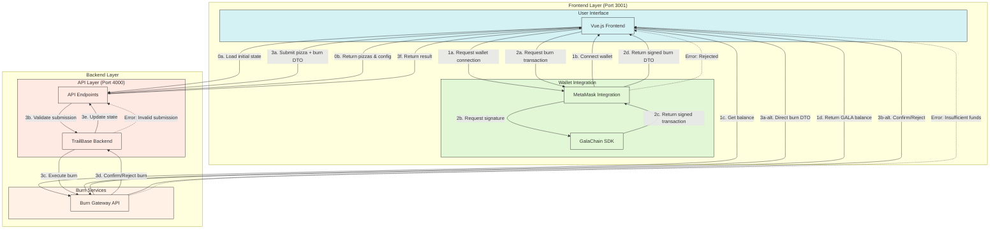

# Technical Architecture Deep Dive - GalaChain Pizza dApp

This document provides a high-level technical overview of the GalaChain Pizza dApp so that you can quickly understand the key components, data flows, and integration points.

---

## System Architecture Overview

### 1. Frontend Layer (Port 3001)

The frontend is built with Vue 3 (Composition API) using TypeScript and Vite. The main responsibilities include wallet connectivity via MetaMask, transaction signing using the GalaChain SDK, and interacting with the backend API.

#### Overview Diagram


#### Key Components
- **MetamaskConnectClient**: Manages wallet connectivity and transaction signing.
  ```typescript
  const metamaskClient = new MetamaskConnectClient();
  // Handles wallet operations and signs a token burn request:
  const signedBurnDto = await metamaskClient.sign("BurnTokens", burnTokensDto);
  ```
- **Vue Components Structure**:
  - `App.vue`: Root container that manages wallet state and routes.
  - `ListByVotes.vue`: Displays pizza submissions for voting (burning tokens to vote).
  - `NewPizzaSubmit.vue`: Provides a form for creating new pizza submissions (including GALA burning).
  - `Account.vue`: Shows wallet details, balance information, and other actions such as token transfers.

  
### Technical Flow Summary

### 0. Application Initialization
```typescript
// Frontend loads initial state
const initialState = await fetch(`${apiBase}/api/pizzas`);
const config = await fetch(`${apiBase}/api/config`);
```

### 1. Wallet Setup
```typescript
// Connect wallet and get balance
const metamaskClient = new MetamaskConnectClient();
await metamaskClient.connect();
const balance = await getGalaBalance(walletAddress);
```

### 2. Transaction Preparation & Signing
```typescript
// Construct and sign burn transaction
const burnTokensDto = {
    owner: walletAddress,
    tokenInstances: [{
        quantity: burnAmount,
        tokenInstanceKey: {
            collection: "GALA",
            category: "Unit",
            type: "none",
            additionalKey: "none"
        }
    }]
};
const signedBurnDto = await metamaskClient.sign("BurnTokens", burnTokensDto);
```

### 3. Execution Paths

#### Path A: Pizza Submission with Burn
```typescript
// Submit pizza with burn transaction
const response = await fetch(`${apiBase}/api/pizzas`, {
    method: 'POST',
    body: JSON.stringify({
        pizza: pizzaData,
        burnDto: signedBurnDto
    })
});
```

#### Path B: Direct Burn
```typescript
// Direct burn transaction
const response = await fetch(`${BURN_GATEWAY_API}/BurnTokens`, {
    method: 'POST',
    body: JSON.stringify(signedBurnDto)
});
```

### Key Points for Developers

1. **Initial Load**
   - App loads pizza list and configuration
   - Sets up initial state before wallet connection

2. **Wallet Integration**
   - MetaMask connection required for burns
   - Balance check performed after connection
   - GalaChain SDK handles transaction signing

3. **Two Burn Paths**
   - Pizza submission: Goes through API Layer → TrailBase → Burn Gateway
   - Direct burn: Frontend → Burn Gateway directly

4. **Error Handling**
   - Wallet connection failures
   - Signature rejections
   - Insufficient funds
   - Invalid submissions
   - Network errors

5. **State Management**
   - Frontend maintains wallet and balance state
   - TrailBase manages pizza submissions
   - All burns update GALA balance

### Common Error Scenarios
```typescript
try {
    // Handle wallet rejection
    if (!await metamaskClient.connect()) {
        throw new Error('Wallet connection rejected');
    }
    
    // Handle insufficient funds
    if (balance < burnAmount) {
        throw new Error('Insufficient GALA balance');
    }
    
    // Handle failed burns
    if (!burnResponse.ok) {
        throw new Error('Burn transaction failed');
    }
} catch (error) {
    console.error('Transaction failed:', error);
}
```

This flow represents a complete burn transaction cycle in the GalaChain Pizza dApp, from initialization through execution, with proper error handling at each step.

---

### 2. Backend Layer (Port 4000)

The backend is powered by TrailBase with an SQLite database that leverages UUID v7 for primary key generation. It exposes TypeScript-based API routes and includes a built-in administrative interface (accessible on port 4001).

#### TrailBase Server
- **Database**: Uses SQLite with UUID v7 support.
- **API Routes**: TypeScript-based endpoints for processing pizza submissions, votes, and burn transactions.
- **Admin Interface**: Offers a UI for managing database tables and records.

#### Database Schema
```sql
-- Core Tables

-- Pizzas table: Stores pizza submission details.
pizzas (
    id BLOB PRIMARY KEY,
    name TEXT,
    contributor TEXT,
    description TEXT,
    crust_id BLOB,
    sauce_id BLOB
);

-- Pizza votes: Aggregated vote data for each pizza submission.
pizza_votes (
    id BLOB PRIMARY KEY,
    pizza_id BLOB,
    total_votes INTEGER
);

-- Pizza votes by user: Tracks individual user votes.
pizza_votes_by_user (
    id BLOB PRIMARY KEY,
    identity TEXT,
    pizza_id TEXT,
    burn_id TEXT,
    votes INTEGER
);
```

---

### 3. GalaChain Integration Points

GalaChain is used for secure token burning which is integral to both the pizza submission and voting processes.

#### Token Burning Flow

1. **Frontend Initiation**: Construct the burn transaction details.
   ```typescript
   const burnTokensDto = {
       owner: walletAddress,
       tokenInstances: [{
           quantity: burnCostSubmit.value.toFixed(),
           tokenInstanceKey: {
               collection: "GALA",
               category: "Unit",
               type: "none",
               additionalKey: "none",
               instance: "0"
           }
       }]
   };
   ```
2. **Transaction Signing**: Sign the burn transaction using MetaMask.
   ```typescript
   const signedBurnDto = await metamaskClient.sign("BurnTokens", burnTokensDto);
   ```
3. **Backend Verification**: Forward the signed request to the backend for verification and processing.
   ```typescript
   const burnResponse = await fetch(`${BURN_GATEWAY_API}/BurnTokens`, {
       method: "POST",
       headers: { "Content-Type": "application/json" },
       body: JSON.stringify(burnDto)
   });
   ```

---

## Security Architecture

### 1. Frontend Security
- **MetaMask Signature Verification**: Ensures that only valid transaction requests are processed.

### 2. Backend Security
- **UUID v7 Identifiers**: Provides a high-security mechanism for unique identifiers.
- **SQL Injection Prevention**: Uses parameterized queries along with basic XSS/SQL injection sanitization.
- **Access Control**: Managed through TrailBase's `record_apis` configuration for authenticated usage.

### 3. GalaChain Security
- **Secure Transaction Signing**: Leverages MetaMask and the GalaChain SDK.
- **Wallet Address Verification**: Confirms that transactions are initiated from valid addresses.
- **Burn Transaction Validation**: Ensures token burning operations meet the defined cost parameters.

---

## Development Environment Setup

### Required Environment Variables
```env
VITE_BURN_GATEWAY_API=https://gateway-mainnet.galachain.com/api/asset/token-contract
VITE_BURN_GATEWAY_PUBLIC_KEY_API=https://gateway-mainnet.galachain.com/api/asset/public-key-contract
VITE_GALASWAP_API=https://api-galaswap.gala.com/galachain
VITE_PROJECT_ID=<project_id>
VITE_PROJECT_API=http://localhost:4000
VITE_BURN_COST_SUBMIT=10
VITE_BURN_COST_VOTE=1
```

### Docker Configuration
```bash
docker run --platform linux/amd64 \
  -p 4000:4000 \
  -p 4001:4001 \
  --mount type=bind,source="$(pwd)"/traildepot,target=/app/traildepot \
  trailbase/trailbase \
  /app/trail run --dev --address "0.0.0.0:4000" --admin-address "0.0.0.0:4001"
```

---

## API Endpoints

### Frontend-Facing Endpoints
- `GET /api/pizza-menu`: Retrieves pizza component details.
- `GET /api/pizzas`: Returns all pizza submissions with corresponding vote counts.
- `POST /api/pizzas`: Creates a new pizza submission and initiates a burn transaction.
- `POST /api/pizzas/{id}/vote`: Records a vote through a token burn transaction.

### GalaChain Endpoints
- `/BurnTokens`: Processes GALA token burning.
- `/api/asset/public-key-contract`: Retrieves public key data.
- `/api/asset/token-contract`: Manages token contract interactions.

---

## Data Flow Architecture

### Pizza Submission Flow
1. User connects their wallet.
2. Submits a pizza configuration.
3. Signs a burn transaction.
4. The backend verifies the burn.
5. Pizza data is stored in the SQLite database.
6. Vote counts are updated accordingly.

### Voting Flow
1. User selects a pizza to vote on.
2. Specifies the burn amount.
3. Signs the transaction using MetaMask.
4. Backend verifies and processes the burn.
5. The pizza's vote count is updated.
6. The user's vote is recorded.

---

## Performance Considerations

### Frontend Optimization
- **Route-Based Code Splitting**: Enables faster load times by splitting the application into smaller chunks.
- **Minimal Dependencies**: Reduces bundle size.
- **TypeScript**: Provides type safety and early error detection.

### Backend Efficiency
- **SQLite Indexes**: Enhance quick data lookups.
- **Prepared Statements**: Secure and optimize queries.
- **Connection Pooling**: Improves database performance under load.

### GalaChain Integration
- **Asynchronous Transactions**: Ensures non-blocking operation during token burns.
- **Error Boundaries**: Enhance fault tolerance.
- **Transaction Tracking**: Monitors the progress and status of burn transactions.

---

## Development Workflow

### Local Development
1. Start the TrailBase backend.
2. Run the frontend development server with `npm run dev`.
3. Connect your MetaMask wallet.
4. Test token burn transactions (both submission and voting flows).

### Testing Strategy
- Frontend component testing.
- API endpoint testing.
- Full transaction flow testing.
- Thorough verification of error handling and recovery procedures.

---

## Deployment Architecture

### Production Considerations
1. Configure environment variables appropriately.
2. Set proper CORS settings.
3. Implement SSL/TLS for secure communication.
4. Schedule regular database backups.
5. Monitor real-time transaction activity.

### Scaling Strategy
- Frontend deployed via static hosting.
- Backend containerized for scalable deployments.
- Optimized database queries and indices.
- Transaction queue management for handling high throughput.

---

## Error Handling

### Frontend Error Handling
```typescript
try {
    const signedBurnDto = await metamaskClient.sign("BurnTokens", burnTokensDto);
} catch (e) {
    // Handle MetaMask or signature errors here.
}
```

### Backend Error Handling
```typescript
if (!burnResponse.ok) {
    console.log(`Failed to burn $GALA: ${burnResponse.status}`);
    throw new Error(`Failed to burn $GALA`);
}
```

### BurnGalaDto Interface
```typescript
export interface BurnGalaDto {
    owner: string;
    tokenInstances: {
        quantity: string;
        tokenInstanceKey: {
            collection: string;
            category: string;
            type: string;
            additionalKey: string;
            instance?: string;
        }
    }[];
    uniqueKey?: string;
}
```

### State Management Details

#### Initial State Loading
```typescript
// Load pizza list for voting
const initialState = await fetch(`${apiBase}/api/pizzas`);

// Load pizza menu configuration (toppings, etc)
const pizzaMenu = await fetch(`${apiBase}/api/pizza-menu`)
  .then(response => {
    if (!response.ok) throw new Error(`Failed to fetch pizza menu`);
    return response.json();
  });
```

### Voting Mechanism

The voting system allows users to burn GALA tokens to vote for pizzas:

```typescript
async function submitVote(pizzaId: string, voteAmount: string) {
  // 1. Create and sign burn transaction
  const burnTokensDto = {
    owner: walletAddress,
    tokenInstances: [{
      quantity: voteAmount,
      tokenInstanceKey: {
        collection: "GALA",
        category: "Unit",
        type: "none",
        additionalKey: "none",
        instance: "0"
      }
    }],
    uniqueKey: `january-2025-event-${PROJECT_ID}-${Date.now()}`
  };

  // 2. Get signature via MetaMask
  const signedBurnDto = await metamaskClient.sign("BurnTokens", burnTokensDto);

  // 3. Submit vote with burn transaction
  const response = await fetch(`${apiBase}/api/pizzas/${pizzaId}/vote`, {
    method: "POST",
    headers: { "Content-Type": "application/json" },
    body: JSON.stringify(signedBurnDto)
  });

  // 4. Handle response
  if (!response.ok) {
    throw new Error('Failed to submit vote');
  }

  // 5. Refresh vote list
  await fetchVoteList();
}
```

Key voting features:
- One GALA token equals one vote
- Users can vote multiple times for the same pizza
- Votes are tracked per user address
- Vote counts update in real-time after successful burns


